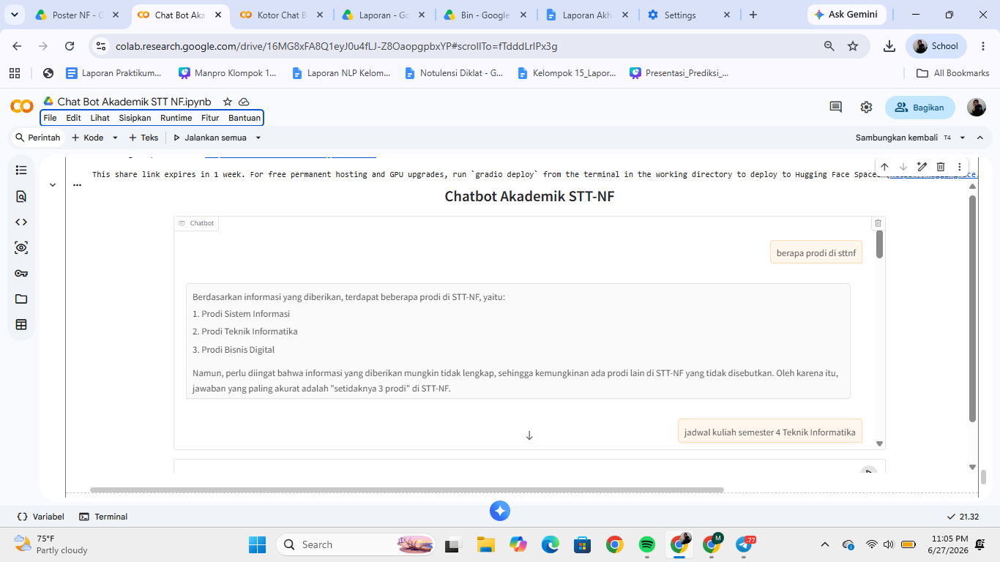

# 🎓 Chatbot Akademik STT Nurul Fikri

Chatbot berbasis RAG (Retrieval-Augmented Generation) untuk menjawab pertanyaan seputar informasi akademik STT Nurul Fikri secara otomatis dan akurat.

## 📸 Demo UI



## 📌 Deskripsi

Sistem chatbot ini dibangun menggunakan pipeline RAG yang menggabungkan:
- Web scraping konten dari website akademik STT-NF
- Download & OCR poster/infografis dari halaman akademik
- Embedding multibahasa untuk representasi dokumen
- Pencarian semantik berbasis FAISS
- Generasi jawaban menggunakan LLM LLaMA 3.3

## 🛠️ Teknologi yang Digunakan

| Komponen | Teknologi |
|----------|-----------|
| Web Scraping | `requests`, `BeautifulSoup` |
| OCR | `pytesseract`, `Pillow` |
| Embedding | `intfloat/multilingual-e5-base` |
| Vector Store | `FAISS` |
| Orkestrasi | `LangChain` |
| LLM | `LLaMA 3.3-70b-versatile` via Groq API |
| UI | `Gradio` |

## 🔄 Alur Sistem (Pipeline)

```
Website STT-NF
    ↓ Web Scraping (BeautifulSoup)
Teks HTML (47 halaman)
    ↓ Download Poster/Infografis
Gambar dari halaman akademik
    ↓ OCR (EasyOCR)
Teks dari gambar → digabung ke DataFrame
    ↓ Merge + Cleaning → dataset_nf_full.csv
    ↓ Load ke LangChain Documents
    ↓ Chunking (chunk_size=500, overlap=100)
    ↓ Embedding (multilingual-e5-base) + prefix "passage:"
FAISS Index
    ↓ Retrieval (top-5 chunk relevan)
LLaMA 3.3 via Groq API
    ↓ Generate Jawaban
Chatbot Response (Gradio UI)
```
## ▶️ Cara Menjalankan

1. Clone repo ini
2. Buka file `Chat_Bot_Akademik_STT_NF.ipynb` di Google Colab
3. Jalankan semua cell dari atas ke bawah secara berurutan
4. Set Groq API key di Colab Secrets dengan nama `groq_api`
5. Jalankan cell Gradio di bagian akhir untuk membuka UI chatbot

## 📊 Hasil Evaluasi

Evaluasi dilakukan terhadap 5 pertanyaan menggunakan metrik Precision, Recall, dan F1-Score dengan membandingkan jawaban chatbot terhadap referensi jawaban ideal.

- **Precision** : 1.00
- **Recall** : 0.62
- **F1-Score** : 0.77

Nilai Precision 1.00 menunjukkan semua kata yang diprediksi chatbot relevan dengan referensi. Recall 0.62 menunjukkan chatbot berhasil mencakup sekitar 62% informasi dari referensi ideal, yang wajar karena jawaban LLM cenderung lebih panjang dan variatif dibanding referensi singkat.

## 👥 Anggota Kelompok

| Nama | NIM |
|------|-----|
| Syauqi Rabbani | 0110224208 |
| Linda Agistina Handani | 0110224043 |
| Mutia Rahma Amaliyah | 0110224131 |
| Silva Nurzanatul Dahmalena | 0110224021 |
| Fahrezi Noviansyah | 0110224171 |

## 🏫

STT Terpadu Nurul Fikri — Mata Kuliah Natural Language Processing 2026
